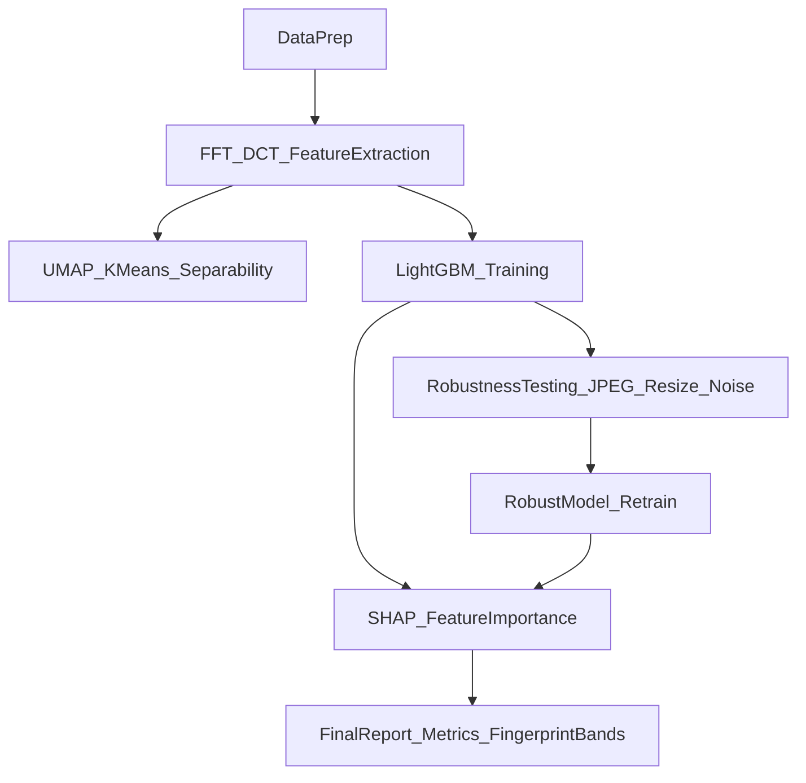

# AIGC图像频谱指纹挖掘与伪造检测计划

## 目标与任务定义
- **任务1（二分类）**：判别图像是否为AI生成（Real vs AIGC）。
- **任务2（多分类归因）**：在AIGC样本中识别生成源（`ADM_SELECTED`、`BIGGan_selected`、`VDQM_selected`、`glide_selected`），可扩展到“Real+4生成源”五分类。
- **核心约束**：尽量减少对语义内容依赖，重点使用频域统计特征与可解释模型。

## 推荐算法组合
- **频域变换**：`FFT(2D)` 为主，`DCT(2D)` 为辅（互补验证）。
- **特征工程**：
  - 径向平均功率谱（Radial PSD）
  - 方向能量分布（Angular Spectrum）
  - 高频能量比例（如半径区间分桶）
  - 频谱斜率（log-power vs log-frequency）
  - 高频残差统计（均值、方差、峰度、偏度）
  - 局部频谱不均匀性指标（patch级方差）
- **建模**：
  - **主模型**：`LightGBM`（分类，支持特征重要性与SHAP解释）
  - **对照模型**：`XGBoost` / `RandomForest` / `LogisticRegression`（稳健性与可解释性对照）
  - **归因探索**：`UMAP + KMeans`（先看生成源聚类可分性）

## 分阶段实施步骤

### 1) 数据整理与协议设计
- 统一分辨率（建议 `256x256` 或 `512x512`，先固定一种）。
- 统一色彩空间（先做灰度通道频谱，再补充RGB分通道频谱）。
- 切分方案：`train/val/test`（例如 7:1:2），并保证每类数量平衡。
- 记录元数据：来源类别、图像尺寸、压缩质量、是否增强。

### 2) 频谱特征提取管线
- 对每张图执行：去均值 -> 窗函数（Hann，可选）-> FFT与DCT。
- 计算功率谱并中心化（fftshift）。
- 提取全局与分桶特征：
  - 径向分桶（如 32/64 bins）
  - 角度分桶（如 12/18 bins）
  - 低/中/高频能量比
  - 高频尾部衰减系数
- 导出结构化特征表（每行一张图）。

### 3) 指纹可分性探索（无监督）
- 在标准化特征上做 `PCA/UMAP` 降维可视化。
- 用 `KMeans` 或 `GMM` 观察四类生成源是否出现簇结构。
- 若簇重叠明显，迭代增加：方向性特征、局部patch频谱统计。

### 4) 监督学习训练
- **任务1（二分类）**：Real vs AIGC，用LightGBM主训。
- **任务2（多分类）**：ADM/BIGGAN/VDQM/GLIDE（或含Real五分类）。
- 评估指标：
  - 二分类：AUC、EER、F1、ACC
  - 多分类：Macro-F1、Balanced ACC、混淆矩阵
- 使用分层K折或固定验证集调参（学习率、深度、叶子数、特征采样）。

### 5) 鲁棒性评估（关键）
- 对测试集施加扰动并复测：
  - JPEG压缩（Q=95/75/50）
  - 缩放（0.5x, 0.75x, 1.5x）再回采样
  - 高斯噪声（\sigma=2,5,10）
  - 轻度模糊（可选）
- 分析性能退化曲线，筛选“扰动后稳定”的特征子集。
- 训练一个鲁棒版模型（用混合扰动数据训练）并与基线比较。

### 6) 可解释性与“关键哨位”频段定位
- 基于LightGBM输出 `feature_importance` 与 `SHAP`。
- 将重要特征映射回频率半径/角度区间，形成“关键频段”报告。
- 给出每个生成源的差异签名（例如某高频段能量异常偏高）。

### 7) 结果交付与复现实验
- 固定随机种子、保存配置与模型权重。
- 输出统一报告：
  - 任务1与任务2主指标
  - 鲁棒性退化对比
  - 关键频段解释图
  - 错误案例分析（混淆最多的类别对）

## 建议的实验顺序（降低风险）
- 第1周：数据协议+FFT基线特征+二分类Baseline。
- 第2周：多分类归因+UMAP/KMeans探索。
- 第3周：鲁棒性攻击与抗扰训练。
- 第4周：可解释性分析+最终报告与答辩材料。

## 默认实现细节（可直接采用）
- 图像输入：先用灰度 `256x256`。
- 频谱特征维度：径向64 + 角向18 + 统计量20左右（总计约100-150维）。
- 主模型参数起点：LightGBM `num_leaves=31`, `max_depth=-1`, `learning_rate=0.05`, `n_estimators=500`。
- 判别策略：先做“二分类高精度”，再做“多分类归因”。

## 流程图

## 你这组数据的具体落地建议
- 将 `ADM_SELECTED`、`BIGGan_selected`、`VDQM_selected`、`glide_selected` 作为四个生成域标签。
- 再补一组真实图像（GenImage真实子集）作为Real类，形成二分类和五分类两条任务线。
- 若样本量不均衡，优先采用：分层采样 + 类别权重 + Macro-F1主指标。
