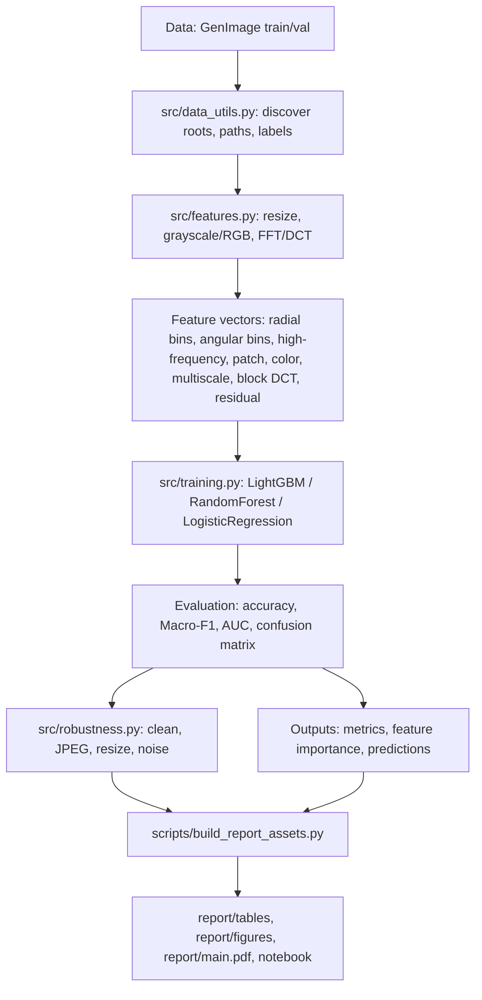

# AIGC_Detector 项目小白深入导读

## 项目一句话概括

这是一个**基于频谱指纹的 AIGC 图像检测与生成源归因项目**：它不直接让深度网络“看图认图”，而是把图像转换到频域，提取可解释的 FFT/DCT 等统计特征，再用 LightGBM 等传统机器学习模型判断图像是 AI 生成还是自然图像，并进一步判断 AI 图像来自 ADM、BigGAN、VQDM、GLIDE 中的哪一个生成源。

本导读以仓库当前代码为准，重点参考 `README.md`、`AIGC_plan.md`、`train.py`、`test.py`、`src/data_utils.py`、`src/features.py`、`src/training.py`、`src/robustness.py`、`scripts/`、`report/`、`notebooks/`。

## 背景动机

AI 图像表面上越来越像真实照片，但生成过程往往和相机拍摄不同。真实照片来自镜头、传感器、压缩和自然纹理；生成图像来自 GAN、扩散模型、上采样、去噪、解码器等计算过程。这些过程可能在人眼不容易注意的地方留下规律，例如某些高频更强、某些方向纹理更整齐、颜色通道的频谱分布更异常。

可以把图像想象成一段音乐：

| 视觉世界 | 类比 |
| --- | --- |
| 图像像素 | 一首歌的波形 |
| 频域 | 调音台里不同频率的音量 |
| 高频 | 细节、边缘、噪声、纹理 |
| 低频 | 大块明暗、整体轮廓 |
| 频谱指纹 | 某台设备或某个歌手留下的“音色习惯” |

本项目选择“可解释频谱特征 + 轻量模型”，而不是直接训练 CNN/ViT 黑盒，主要有三个实际原因：

1. **可解释**：`src/features.py` 里的每个特征都有明确含义，例如径向功率谱、角向能量、高频统计、DCT 块特征。最后还能输出 `feature_importance.csv` 看模型依赖哪些频段或通道。
2. **轻量可复现**：代码不需要训练大型深度网络，主要依赖 `numpy/scipy/pillow/scikit-learn/lightgbm`，见 `requirements.txt`。
3. **贴合题目**：`AIGC_plan.md` 明确规划的是频域统计特征与 LightGBM 路线，而当前代码也确实沿着这条路线实现。

注意：`AIGC_plan.md` 中提到 SHAP、UMAP/KMeans 等探索方向，但当前代码与报告资产里主要实现的是 `feature_importance.csv`、混淆矩阵、鲁棒性和置信度分析；没有发现完整 SHAP 计算脚本。因此相关解释以代码当前实现为准。

## 核心任务

| 任务 | 代码入口 | 目标 | 标签 |
| --- | --- | --- | --- |
| 任务 1：AI vs Nature 二分类 | `train.py` 的 `main()` / `run_task()`，`test.py` 调用同一个 `run_task()` | 判断一张图是 AI 生成还是自然图像 | `ai`、`nature` |
| 任务 2：AI 生成源归因 | `train.py` 的 Task 2 分支，`test.py` 的归因分支 | 在 AI 图像中判断来自哪个生成器 | `ADM`、`BigGAN`、`VQDM`、`glide` |
| 鲁棒性测试 | `src/robustness.py`，`scripts/evaluate_best_robustness.py` | 测试 JPEG、缩放、噪声后模型是否还稳定 | clean / jpeg / resize / noise |

当前 README 的最终主结果是 `outputs_v2_full_best`：`fusion_freq + flat LightGBM + wide profile + full training`。Clean validation 指标为：

| Task | Accuracy | Macro-F1 | AUC |
| --- | ---: | ---: | ---: |
| AI vs Nature | 0.9913 | 0.9913 | 0.9996 |
| Source attribution | 0.9991 | 0.9991 | - |

这些指标可在 `README.md`、`outputs_v2_full_best/*/metrics_summary.json`、`report/tables/optimization_v2_summary.csv` 中互相对应。另一个文件 `report/tables/final_result_selection.csv` 仍记录早期 baseline 选择 `outputs_4gen_full_best`；理解当前最终结果时，应以 `README.md`、`report/asset_manifest.md` 和 `report/tables/optimization_v2_summary.csv` 的 v2 选择为准。

还有一个小命名差异：`AIGC_plan.md` 早期计划里写过 `VDQM_selected`，但当前 README、代码发现逻辑、报告表格和本地数据目录使用的是 `VQDM`。后续解释统一以当前代码和 README 的 `VQDM` 为准。

## 小白词汇表

| 词 | 生活化解释 |
| --- | --- |
| AIGC | AI 生成内容。这里特指 AI 生成图像，就像“机器画出来的图片”。 |
| GenImage | 一个用于检测 AI 生成图像的数据集。可以把它理解成考试题库，里面有真实图和不同 AI 模型生成的图。 |
| `ai` / `nature` | `ai` 是 AI 生成图，`nature` 是自然/真实图。它们是二分类任务的两个答案。 |
| `train` / `val` | `train` 是练习题，模型用它学习；`val` 是考试题，本项目把它当测试集使用。见 `README.md` 与 `train.py` 的终端说明。 |
| FFT | 快速傅里叶变换。像把一张图放进“频率分析仪”，看不同粗细纹理的能量。见 `src/features.py` 的 `_windowed_power()`。 |
| DCT | 离散余弦变换。JPEG 压缩也常用类似思想；这里用它看图像块和整体频率结构。见 `_dct_radial_profile()` 与 `_block_dct_features()`。 |
| 频域 | 不直接看“哪个像素是什么颜色”，而看“不同频率的纹理有多强”。 |
| 功率谱 | 每个频率的能量地图。能量越大，说明该频率成分越明显。代码里用 `log1p(abs(FFT)^2)` 表示。 |
| 径向 bins | 从频谱中心向外一圈圈切开，像洋葱圈。越靠外通常越高频。见 `_radial_profile()`。 |
| 角向 bins | 按方向切频谱，像把披萨切成很多角。用于观察横向、纵向、斜向纹理是否不同。见 `_angular_profile()`。 |
| LightGBM | 一种高效的树模型。可以理解成很多“如果某个频段能量大于多少就往哪边判断”的规则组合。见 `src/training.py`。 |
| Macro-F1 | 每个类别先各算一个 F1，再平均。适合看多类别是否都表现好，不让大类别掩盖小类别。 |
| AUC | 二分类排序能力指标。越接近 1，说明模型越能把 AI 和 nature 分开。代码只在二分类且有概率输出时计算，见 `evaluate_predictions()`。 |
| 混淆矩阵 | 一张“真实类别 vs 预测类别”的错题表。能看出 ADM 是否常被错判成 VQDM。 |
| 鲁棒性 | 图像被压缩、缩放、加噪后，模型还能不能稳住。见 `src/robustness.py`。 |
| `feature_importance` | LightGBM 给出的特征重要性表，表示哪些频谱特征更常被树模型使用。不是因果证明，但很适合解释模型关注点。 |

## 仓库目录导览

| 路径 | 作用 |
| --- | --- |
| `README.md` | 当前项目总览、数据布局、安装命令、核心运行命令、当前最终结果。 |
| `AIGC_plan.md` | 早期方案设计，说明为什么做频域特征、任务和实验规划；部分计划项如 SHAP 当前未完整落地。 |
| `requirements.txt` | Python 依赖列表：`numpy`、`pandas`、`scipy`、`scikit-learn`、`lightgbm`、`pillow` 等。 |
| `train.py` | 完整训练入口，不做抽样；发现数据、提特征、训练模型、保存指标和模型。 |
| `test.py` | 抽样 smoke test/实验入口；支持 `--sample-fraction`、样本缓存、断点跳过，实际也可用 `--sample-fraction 1.0` 跑当前 best 路线。 |
| `src/data_utils.py` | 发现图片、识别单根/多生成器目录、生成 `Sample(path, label)`、统计标签。 |
| `src/features.py` | 把图片变成频谱特征；实现 FFT、DCT、颜色频谱、多尺度、块 DCT、残差频谱、训练增强。 |
| `src/training.py` | 构建候选模型、LightGBM 参数 profile、模型架构、阈值校准、评估指标、特征重要性。 |
| `src/robustness.py` | clean/JPEG/resize/noise 鲁棒性评估，支持缓存、并行提特征和输出攻击级结果。 |
| `scripts/` | 实验编排和报告资产脚本，包括鲁棒性复测、报告图表生成、LOGO 泛化、置信度分析、提交校验等。 |
| `report/` | 当前报告源码、PDF、表格和图片资产，包含 `main.tex`、`main.pdf`、`figures/`、`tables/`。 |
| `notebooks/` | 当前发现 `final_project_aigc_detector.ipynb`，主要读取 `report/tables` 和 `report/figures` 做展示，不重新大规模训练。 |

## 数据组织方式

README 推荐把 GenImage 原始数据放在仓库外，例如：

```text
C:\Users\99303\git\GenImage_data\
  ADM\
    train\ai
    train\nature
    val\ai
    val\nature
  BigGAN\
    train\ai
    train\nature
    val\ai
    val\nature
  VQDM\
  glide\
```

请不要把 GenImage 原始图片提交到 GitHub。`README.md` 也提醒：`GenImage_data`、`feature_cache*`、`robustness_cache*`、`sample_cache`、`.venv`、完整 `outputs_*` 运行目录通常都不应上传，除非课程提交格式明确要求。

### 单根目录布局

如果数据根目录下面直接有：

```text
data\
  train\ai
  train\nature
  val\ai
  val\nature
```

`src/data_utils.py` 的 `discover_model_roots()` 会把 `data` 当成一个 root。二分类用 `train/ai` 和 `train/nature`；归因任务如果要在这种布局下运行，需要在 `train/ai/` 和 `val/ai/` 下面再按生成源建子目录，例如 `train/ai/ADM/...`，这由 `discover_ai_subsource_split()` 支持。

### 多生成器目录布局

如果根目录下面有多个生成器目录，例如 `ADM/BigGAN/VQDM/glide`，每个目录内部都有 `train/ai`、`train/nature`、`val/ai`、`val/nature`，`discover_model_roots()` 会用 `rglob("train")` 找出这些生成器 root。

在这种布局下：

| 任务 | 发现方式 |
| --- | --- |
| 二分类 | `discover_binary_split_multi_root()` 合并每个生成器 root 的 `ai` 和 `nature`。 |
| 归因 | `discover_ai_subsource_from_roots()` 把每个生成器 root 的 `split/ai` 图片打上生成器目录名标签，例如 `ADM`。 |

## 总体流程图



## 逐模块代码讲解

### `src/data_utils.py`：怎么发现图片、打标签、支持多 root

核心数据结构是：

```python
@dataclass
class Sample:
    path: Path
    label: str
```

也就是说，模型训练前并不直接保存图片内容，而是先保存“图片路径 + 标签”。

| 函数 | 做什么 |
| --- | --- |
| `_is_image()` | 判断后缀是否是 `.jpg/.jpeg/.png/.bmp/.webp/.tif/.tiff`。 |
| `_list_images()` | 用递归方式找某个目录下所有图片。 |
| `discover_binary_split()` | 在一个 root 下读取 `split/ai` 和 `split/nature`，分别打标签 `ai` 和 `nature`。 |
| `discover_model_roots()` | 判断数据是单根目录还是多生成器目录，并返回所有可用 root。 |
| `discover_binary_split_multi_root()` | 对多个生成器 root 循环调用二分类发现函数并合并。 |
| `discover_ai_subsource_split()` | 支持 `train/ai/ADM` 这种子目录归因布局。 |
| `discover_ai_subsource_from_roots()` | 支持 `ADM/train/ai`、`BigGAN/train/ai` 这种多 root 归因布局。 |
| `summarize_labels()` | 统计每个标签多少张图，训练前会打印出来。 |
| `validate_non_empty()` | 如果没找到图，直接报错并提示需要 `train/ai`、`train/nature`、`val/ai`、`val/nature`。 |

结论：如果你遇到“没有找到图片”，优先检查数据目录层级是否符合 `discover_model_roots()` 的两种布局。

### `src/features.py`：图片如何变成频谱特征

特征配置由 `FeatureConfig` 控制：

| 参数 | 默认值 | 含义 |
| --- | ---: | --- |
| `image_size` | 256 | 每张图 resize 到 256x256。 |
| `radial_bins` | 64 | 径向频率分桶数量。 |
| `angular_bins` | 18 | 角向方向分桶数量。 |
| `patch_grid` | 4 | 把图切成 4x4 patch 看局部高频变化。 |
| `feature_profile` | `baseline` | 选择基础/增强/融合频谱特征。 |

基础流程见 `_windowed_power()`：

1. 把图像转为 `float32`。
2. 减去均值，减少整体亮度影响。
3. 乘 Hann 窗，降低边界突变带来的频谱伪影。
4. 做 `fft2()` 和 `fftshift()`。
5. 计算 `log1p(abs(spectrum) ** 2)` 得到功率谱。

基础特征见 `_base_frequency_features()`：

| 特征组 | 代码函数 | 直观理解 |
| --- | --- | --- |
| FFT 径向谱 | `_radial_profile()` | 从中心向外一圈圈统计能量，看低频到高频的分布。 |
| FFT 角向谱 | `_angular_profile()` | 按方向统计能量，看横竖斜纹理是否异常。 |
| 低/中/高频能量 | `_band_energy()` | 三段频率各占多少。 |
| 频谱斜率 | `_spectral_slope()` | 高频衰减得快不快。 |
| 高频统计 | `_high_freq_residual_stats()` | 高频区域的均值、波动、偏度、峰度。 |
| patch 高频变化 | `_patch_high_freq_variation()` | 局部小块之间高频是否均匀。 |
| DCT 径向谱 | `_dct_radial_profile()` | 用另一种频域变换补充 FFT。 |

当前代码还支持多个 `feature_profile`：

| Profile | 代码含义 |
| --- | --- |
| `baseline` | 灰度 FFT/DCT 基础特征。 |
| `enhanced` | 在 baseline 后追加五段能量、谱质心/扩散/熵、径向差分、高频分位数、尾部能量比。 |
| `color_freq` | 在 RGB 和 YCbCr 各通道上提取紧凑频谱特征。 |
| `multiscale_freq` | 对多个尺寸提取频谱特征，默认包含约 128、256、384 尺度。 |
| `block_dct` | 提取 8x8 块 DCT、zigzag 系数、块边界统计。 |
| `residual_freq` | 对 median/smooth/laplace 残差图提取频谱。 |
| `stable_freq` | 使用归一化、平滑后的更稳健径向/DCT 特征。 |
| `fusion_freq` | 当前 best 路线，把 baseline + color + multiscale + block DCT + residual 组合起来。 |

训练增强也在 `src/features.py` 中实现：`mild_freq` 会追加轻度 JPEG、resize、noise 版本；`robust_freq` 会追加更多强度的版本。注意 `train.py` 和 `test.py` 都保证 validation 不增强，见 `extract_matrix(... train_augmentation="none")`。

### `src/training.py`：候选模型、LightGBM、指标和特征重要性

训练模块的核心函数是 `train_and_select()`。

候选模型包括：

| 配置 | 实际模型 |
| --- | --- |
| `--model-set lightgbm` | 只训练 LightGBM。README 当前 best 使用这个配置。 |
| `--model-set all` | 训练 LightGBM、RandomForest、LogisticRegression。 |
| `--model-architecture flat` | 普通扁平分类器，当前 best 使用。 |
| `hierarchical_attribution` | 多分类归因时先粗分，再用 ADM/VQDM 专家模型细分。 |
| `pairwise_ovo_attribution` | 多分类归因时训练类别两两模型。 |
| `binary_expert_ensemble` | 二分类时训练全局模型和按生成器分组的专家模型。 |

LightGBM 参数 profile 由 `lightgbm_profile_params()` 定义：`baseline`、`regularized`、`large`、`wide`。当前 best 是 `wide`，主要区别是树更多、学习率稍低、`num_leaves=63`、`min_child_samples=20`。

模型选择逻辑很直接：先算 `accuracy` 和 `macro_f1`；如果是二分类且模型有概率输出，再算 `auc`。所有候选模型按 `macro_f1` 优先、`accuracy` 次优排序，第一名就是 best。

特征重要性由 `feature_importance_df()` 输出。如果模型有 `feature_importances_` 且长度匹配特征名，就写出真实重要性；否则写全 0。因此 `feature_importance.csv` 是 LightGBM 路线最有解释价值的输出之一。

LightGBM GPU 不是硬依赖：`_fit_estimator()` 里如果检测到 GPU LightGBM 报错，会打印 fallback 信息并改用 CPU 训练。

### `src/robustness.py`：clean、JPEG、resize、noise 如何评估稳定性

鲁棒性攻击列表在 `ROBUSTNESS_ATTACKS` 中：

| Attack | Level |
| --- | --- |
| `clean` | `none` |
| `jpeg` | 95、75、50 |
| `resize` | 0.5、0.75、1.5 |
| `noise` | 2、5、10 |

`evaluate_robustness()` 对每个攻击强度做同一件事：

1. 读取 validation 图片。
2. 对图片施加攻击，例如 JPEG 压缩、缩放再放回原尺寸、加高斯噪声。
3. 用同一个 `FeatureConfig` 提取特征。
4. 用训练时保存的 `feature_set` 选择相同特征列。
5. 用已训练模型预测。
6. 输出 `accuracy`、`macro_f1`、二分类 AUC、预测分布等。

`train.py` 内置的鲁棒性只跟随 `run_task()` 做当前任务；最终 README 推荐用 `scripts/evaluate_best_robustness.py`，它会加载 `best_model.joblib`，不用重新训练，并且可以对二分类和归因任务都做鲁棒性评估。

### `train.py`：完整训练入口

`train.py` 是完整训练流程，主要逻辑在 `main()`：

1. 解析命令行参数。
2. 写 `out_dir/run_config.json`。
3. 构造 `FeatureConfig`。
4. 用 `discover_model_roots()` 找数据布局。
5. 运行任务 1：`binary_ai_vs_nature`。
6. 尝试运行任务 2：`ai_subsource_attribution`。如果没有 AI 子源或多 root 信息，就跳过并打印原因。

真正的训练与保存逻辑在 `run_task()`：

| 步骤 | 结果 |
| --- | --- |
| 打印 train/val 标签统计 | 便于确认类别是否平衡。 |
| `extract_matrix()` 提特征 | 可并行，可读写 `.npz` 特征缓存。 |
| `select_feature_columns()` | 根据 `--feature-set` 选全部或某组频谱特征。 |
| `train_and_select()` | 训练候选模型并选 best。 |
| 写模型与指标 | `best_model.joblib`、`metrics_summary.json`、`model_comparison.csv` 等。 |
| 写解释与预测明细 | `feature_importance.csv`、`prediction_details.csv`、`prediction_errors.csv`。 |
| 可选鲁棒性 | 写 `robustness_results.csv`。 |

### `test.py`：抽样 smoke test，适合快速检查流程

`test.py` 不是单元测试，而是“同样流程 + 抽样数据”的实验入口。它调用 `train.py` 的 `run_task()`，所以输出结构和训练逻辑一致。

它额外支持：

| 参数/函数 | 作用 |
| --- | --- |
| `--sample-fraction` | 按标签分层抽样，例如 0.001 只取很少图片做 smoke test。 |
| `--sample-seed` | 固定抽样随机种子。 |
| `--sample-cache-dir` | 把抽到的路径列表写成 CSV，下次复用。 |
| `--resume-completed-tasks` | 如果某任务已有 `metrics_summary.json` 和 `model_comparison.csv`，就跳过。 |

README 当前 best clean route 用的是 `test.py --sample-fraction 1.0`，这是因为 `test.py` 有样本缓存和断点跳过能力，比直接用 `train.py` 更适合长实验管理。

### `scripts/`：实验、鲁棒性和报告资产脚本

| 脚本 | 作用 |
| --- | --- |
| `scripts/evaluate_best_robustness.py` | 加载已有 `best_model.joblib`，对 validation 子集做 clean/JPEG/resize/noise 鲁棒性评估，不重训。 |
| `scripts/build_report_assets.py` | 汇总 `outputs_*` 指标，生成 `report/tables/*.csv` 和 `report/figures/*.png`，包括混淆矩阵、特征重要性、鲁棒性、LOGO、置信度图。 |
| `scripts/validate_submission.py` | 检查数据目录、报告资产、notebook JSON、最终指标、鲁棒性 CSV、Git 大文件排除等，并可写 `report/submission_checklist.md`。 |
| `scripts/run_logo_generalization.py` | Leave-one-generator-out 二分类泛化实验：留出一个生成器，只用其他生成器训练。 |
| `scripts/analyze_confidence_rejection.py` | 读取保存模型，输出预测置信度、margin、entropy、coverage-accuracy、低置信样本和高置信错误。 |
| `scripts/analyze_v2_error_bottlenecks.py` | 汇总错误样本，按生成器、真实标签、预测标签统计错误瓶颈。 |
| `scripts/build_optimization_v2_assets.py` | 汇总第二轮频域优化 `outputs_v2_*`，生成 `optimization_v2_summary.csv` 和图。 |
| `scripts/export_error_analysis.py` | 针对某个已保存输出目录重新导出 `prediction_details.csv` 和 `prediction_errors.csv`。 |
| `scripts/run_experiment_suite.ps1` | 早期抽样实验编排，跑 1%、5%、10% 和部分鲁棒实验。 |
| `scripts/run_optimization_suite.ps1` | baseline 特征缓存、seed 稳定性和特征消融实验。 |
| `scripts/run_lgbm_tuning_suite.ps1` | 比较 LightGBM profile 和 `all/no_dct` 特征集，并选择 10% best。 |
| `scripts/run_enhanced_feature_suite.ps1` | 跑 `enhanced` profile 的搜索和放大实验。 |
| `scripts/run_scaleup_suite.ps1` | 跑 baseline/wide 的 20%、50%、full scale-up。 |
| `scripts/run_v2_optimization_suite.ps1` | 第二轮优化：筛选 `color_freq/multiscale/block_dct/residual/fusion`，再 scale-up。 |
| `scripts/run_4gen_extension_suite.ps1` | 扩展实验：LOGO、stable_freq、mild/robust augmentation、鲁棒性、置信度、报告资产。 |
| `scripts/run_all_4gen_extension_experiments.ps1` | 更完整的扩展实验流水线，带完成检查、预编译和提交校验。 |
| `scripts/start_all_4gen_extension_experiments.ps1` | 后台启动完整扩展实验，把 stdout/stderr 写到 `experiment_logs/`。 |
| `scripts/finalize_submission_assets.ps1` | 构建报告资产、导出错误分析，并在本机有 LaTeX 时编译 PDF。 |

## 一次完整运行指南

以下命令尽量沿用 `README.md` 当前写法。

### 1. 安装环境

```powershell
git clone https://github.com/EricGuo2004/AIGC_Detector.git
cd AIGC_Detector
python -m venv .venv
.\.venv\Scripts\python.exe -m pip install --upgrade pip
.\.venv\Scripts\python.exe -m pip install -r requirements.txt
```

关键依赖见 `requirements.txt`：`pillow` 用来读图，`scipy` 做 FFT/DCT，`scikit-learn` 算指标和 baseline 模型，`lightgbm` 是主模型。

### 2. 快速 smoke test

```powershell
.\.venv\Scripts\python.exe test.py `
  --dataset-root C:\Users\99303\git\GenImage_data `
  --out-dir outputs_smoke_min `
  --sample-fraction 0.001 `
  --skip-robustness
```

参数解释：

| 参数 | 含义 |
| --- | --- |
| `--dataset-root` | GenImage 数据根目录。 |
| `--out-dir` | 输出目录。 |
| `--sample-fraction 0.001` | 每个标签只抽 0.1% 图片，适合检查流程。 |
| `--skip-robustness` | 暂时不做 JPEG/resize/noise，节省时间。 |

### 3. 复现 README 当前 best clean route

```powershell
.\.venv\Scripts\python.exe test.py `
  --dataset-root C:\Users\99303\git\GenImage_data `
  --out-dir outputs_v2_full_best `
  --sample-fraction 1.0 `
  --sample-seed 42 `
  --skip-robustness `
  --lightgbm-device gpu `
  --num-workers 16 `
  --feature-chunksize 64 `
  --feature-cache-dir feature_cache_fusion `
  --sample-cache-dir sample_cache `
  --feature-set all `
  --feature-profile fusion_freq `
  --lgbm-profile wide `
  --model-set lightgbm `
  --model-architecture flat `
  --train-augmentation none `
  --calibrate-threshold `
  --resume-completed-tasks
```

最重要的参数：

| 参数 | 含义 |
| --- | --- |
| `--sample-fraction 1.0` | 使用全部样本。 |
| `--feature-profile fusion_freq` | 使用当前 best 的融合频谱特征。 |
| `--lgbm-profile wide` | 使用更宽的 LightGBM 参数 profile。 |
| `--model-set lightgbm` | 只训练 LightGBM，不跑 RF/logreg。 |
| `--model-architecture flat` | 使用普通扁平分类器。 |
| `--calibrate-threshold` | 二分类时用训练内部切分校准阈值。 |
| `--feature-cache-dir` | 缓存提好的特征，下次更快。 |
| `--sample-cache-dir` | 缓存抽样路径。 |
| `--resume-completed-tasks` | 已完成任务不重复跑。 |

如果没有可用 GPU 或 LightGBM GPU 配置失败，代码会尝试回退 CPU；也可以直接把 `--lightgbm-device gpu` 改成 `cpu`。

### 4. 鲁棒性评估

```powershell
.\.venv\Scripts\python.exe scripts\evaluate_best_robustness.py `
  --dataset-root C:\Users\99303\git\GenImage_data `
  --model-output outputs_v2_full_best `
  --out-dir outputs_v2_full_best_robust_20pct `
  --sample-fraction 0.20 `
  --sample-seed 42 `
  --tasks both `
  --num-workers 16 `
  --feature-chunksize 64 `
  --robust-cache-dir robustness_cache_fusion
```

这一步加载已经训练好的模型，不重新训练。`--tasks both` 表示二分类和归因都评估。输出每个任务的 `robustness_results.csv`，以及各攻击强度下的混淆矩阵和预测分布 CSV。

### 5. 生成报告资产

```powershell
.\.venv\Scripts\python.exe scripts\build_report_assets.py `
  --dataset-root C:\Users\99303\git\GenImage_data `
  --report-dir report `
  --primary-output outputs_v2_full_best `
  --robustness-output outputs_v2_full_best_robust_20pct `
  --robustness-compare-outputs `
    outputs_v2_full_best_robust_20pct `
    outputs_4gen_full_best_robust_20pct `
    outputs_4gen_20pct_stable_freq_robust_20pct `
    outputs_4gen_20pct_fusion_mild_aug_robust_20pct `
    outputs_4gen_20pct_fusion_robust_aug_robust_20pct
```

这会更新 `report/tables` 和 `report/figures`。当前仓库已经有这些资产，例如：

| 资产 | 用途 |
| --- | --- |
| `report/figures/spectrum_examples.png` | 展示 AI/nature 的频谱样例。 |
| `report/figures/confusion_*_lightgbm.png` | 两个任务的混淆矩阵图。 |
| `report/figures/feature_importance_*_top20.png` | Top-20 特征重要性。 |
| `report/figures/robustness_comparison_*.png` | 鲁棒性对比图。 |
| `report/figures/logo_generalization_macro_f1.png` | 留一生成器泛化图。 |
| `report/tables/optimization_v2_summary.csv` | v2 路线实验汇总和当前选择。 |

## 输出文件怎么看

每个任务通常有一个输出子目录，例如：

```text
outputs_v2_full_best/
  binary_ai_vs_nature/
  ai_subsource_attribution/
```

| 文件 | 含义 |
| --- | --- |
| `best_model.joblib` | 保存的模型 bundle，包含模型对象、标签映射、特征配置、特征名、feature profile、feature set 等。 |
| `metrics_summary.json` | 当前任务的 best 模型、所有模型指标和标签列表。 |
| `model_comparison.csv` | 各候选模型的 `accuracy`、`macro_f1`、二分类 `auc`。如果 `--model-set lightgbm`，通常只有一行。 |
| `classification_report_*.txt` | sklearn 分类报告，包括 precision/recall/F1。 |
| `confusion_matrix_*.csv` | 混淆矩阵原始表。报告脚本会把它画成 PNG。 |
| `feature_importance.csv` | 特征重要性表，按 importance 降序排列。 |
| `prediction_details.csv` | 每张 validation 图的路径、真实标签、预测标签、是否正确、置信度、margin、entropy、AI 概率等。 |
| `prediction_errors.csv` | `prediction_details.csv` 中预测错误的子集，适合错误分析。 |
| `robustness_results.csv` | 鲁棒性评估结果，每行是一个攻击类型和强度。 |
| `run_config.json` | 本次运行的命令行参数，复现实验时很重要。 |

## 当前结果如何解读

根据 `README.md` 和 `outputs_v2_full_best/*/metrics_summary.json`，当前 clean validation 很强：

| 任务 | Clean Macro-F1 |
| --- | ---: |
| AI vs Nature | 0.99125 |
| AI source attribution | 0.99908 |

这说明在 ADM、BigGAN、VQDM、GLIDE 四个 GenImage 生成源的当前 train/val 协议下，频谱融合特征足以让 LightGBM 学到非常强的区分规则。

但不能只看 clean accuracy。根据 `report/tables/robustness_binary_ai_vs_nature.csv` 和 `report/tables/robustness_ai_subsource_attribution.csv`：

| 条件 | 二分类 Macro-F1 | 归因 Macro-F1 |
| --- | ---: | ---: |
| clean | 0.9908 | 0.9992 |
| JPEG 95 | 0.6607 | 0.2952 |
| resize 0.5 | 0.3671 | 0.1551 |
| noise 10 | 0.3377 | 0.1000 |

这说明当前 `fusion_freq` 模型在干净验证集上很强，但图像后处理会显著改变频谱统计，导致性能下降。报告也把鲁棒性定位为诊断项，而不是和 clean 指标混在一起当最终主分数。

跨生成器留一测试也揭示了风险，见 `report/tables/logo_generalization.csv`：held-out GLIDE 较容易，Macro-F1 约 0.8877；held-out VQDM 较难，Macro-F1 约 0.4386。这说明模型确实学到一些通用 AIGC 频谱线索，但也依赖已见生成器的特定频谱指纹。

## 项目优点、局限与改进方向

### 优点

| 优点 | 说明 |
| --- | --- |
| 可解释 | 特征名直接对应频域统计，`feature_importance.csv` 可追踪重要频段/通道。 |
| 轻量 | 不训练 CNN/ViT，主要是特征工程 + LightGBM。 |
| 复现方便 | README 给出完整命令，输出里有 `run_config.json`。 |
| 实验闭环完整 | 有 clean、鲁棒性、LOGO 泛化、置信度、错误分析、报告资产生成。 |

### 局限

| 局限 | 说明 |
| --- | --- |
| 依赖特定生成器频谱 | LOGO 结果说明对未见生成器泛化不均。 |
| 后处理鲁棒性下降 | JPEG、resize、noise 会破坏或改变高频/颜色频谱指纹。 |
| 数据域有限 | 当前最终报告围绕 GenImage 的 ADM、BigGAN、VQDM、GLIDE 四个生成源。 |
| 不是端到端深度检测器 | 项目目标是可解释频域检测，不与大型 CNN/ViT SOTA 直接竞争。 |
| SHAP 尚未落地 | `AIGC_plan.md` 有 SHAP 规划，但当前代码主要输出 LightGBM feature importance。 |

### 改进方向

1. **更强鲁棒训练**：继续改进 `mild_freq` / `robust_freq`，或加入更多真实后处理组合。
2. **跨生成器留一验证**：把 LOGO 作为常规模型选择指标，而不只做扩展分析。
3. **更多真实数据**：扩大 nature 数据来源，降低模型学到数据集偏差的风险。
4. **更多扰动类型**：加入 blur、crop、社交媒体二次压缩、截图重采样等。
5. **稳健特征融合**：把 `stable_freq` 的稳定性和 `fusion_freq` 的 clean 性能做更细的权衡。
6. **更严格防泄漏检查**：记录文件哈希、去重、确认 train/val 没有重复或近重复图片。

## FAQ

### 1. 数据路径不对怎么办？

先确认路径下是否有 `ADM/train/ai` 这样的结构。代码只认 `train/ai`、`train/nature`、`val/ai`、`val/nature`。如果默认 `data` 无效，`train.py` 和 `test.py` 会尝试 fallback 到当前目录或脚本目录，但正式运行建议显式传 `--dataset-root C:\Users\99303\git\GenImage_data`。

### 2. 为什么显示没有找到图片？

可能原因：

| 原因 | 排查 |
| --- | --- |
| 目录层级不符合 | 对照 README 的 GenImage 目录结构。 |
| 图片后缀不支持 | `data_utils.py` 只认常见图片后缀，见 `IMAGE_SUFFIXES`。 |
| 数据在压缩包里 | 需要先解压，代码不会读压缩包内部。 |
| 归因任务缺子源 | 单根布局下需要 `train/ai/<generator>/...`；多 root 布局下需要 `ADM/train/ai/...` 等。 |

### 3. LightGBM/GPU 不可用怎么办？

如果安装了 LightGBM 但 GPU 训练失败，`src/training.py` 会在 LightGBM GPU error 时回退 CPU。你也可以直接用 `--lightgbm-device cpu`。如果完全没有安装 LightGBM，`--model-set lightgbm` 会报错；需要重新安装依赖。

### 4. 运行太慢怎么办？

优先用 `test.py --sample-fraction 0.001` 跑 smoke test。确认流程没问题后，再逐步增大比例。正式大实验建议设置：

```powershell
--num-workers 16 `
--feature-chunksize 64 `
--feature-cache-dir feature_cache_fusion `
--sample-cache-dir sample_cache `
--resume-completed-tasks
```

### 5. `outputs_*` 太大怎么办？

大输出目录和缓存通常是本地实验产物，不建议提交。README 已提醒不要上传 `feature_cache*`、`robustness_cache*`、`sample_cache` 和完整 `outputs_*`，除非课程要求。

### 6. 归因任务为什么被跳过？

`train.py` 会先用 `discover_ai_subsource_split()`，再 fallback 到 `discover_ai_subsource_from_roots()`。如果仍然没有至少两个 AI 子源标签，就会跳过并提示。检查你的数据是否有多个生成器目录，或 `train/ai` 下是否有生成器子目录。

### 7. 指标太高是否可信？

Clean 指标很高不一定等于真实部署可靠。应同时看：

| 检查 | 文件 |
| --- | --- |
| 鲁棒性下降 | `robustness_results.csv`、`report/tables/robustness_*.csv` |
| 跨生成器泛化 | `report/tables/logo_generalization.csv` |
| 错误类型 | `prediction_errors.csv`、`v2_error_breakdown_*.csv` |
| 混淆矩阵 | `confusion_matrix_*.csv` / `report/figures/confusion_*.png` |

当前 README 也明确说：鲁棒性是诊断结果，不能只看 clean accuracy。

### 8. README 和某些 report CSV 不一致怎么办？

以当前代码输出和 README 当前结果为准。具体来说，README、`report/asset_manifest.md`、`report/main.tex`、`report/tables/optimization_v2_summary.csv` 都指向 `outputs_v2_full_best`；而 `report/tables/final_result_selection.csv` 记录的是早期 baseline 选择，不代表 README 当前最终路线。

## 小白学习路线

1. **先看 `README.md`**：理解项目目标、数据布局、当前最终结果和核心命令。
2. **跑 `test.py` smoke test**：用 `--sample-fraction 0.001` 检查环境和数据路径。
3. **看输出 CSV**：先读 `metrics_summary.json`、`model_comparison.csv`、`confusion_matrix_*.csv`、`feature_importance.csv`。
4. **再读 `src/features.py`**：理解一张图片如何变成 FFT/DCT/高频/颜色/残差特征。
5. **再读 `src/training.py`**：理解 LightGBM、Macro-F1、AUC、模型选择和特征重要性。
6. **再读 `src/robustness.py`**：理解为什么 JPEG、resize、noise 会让模型掉分。
7. **最后看 `report/` 和 notebook**：用图表把实验结论串起来，准备展示或答辩。
